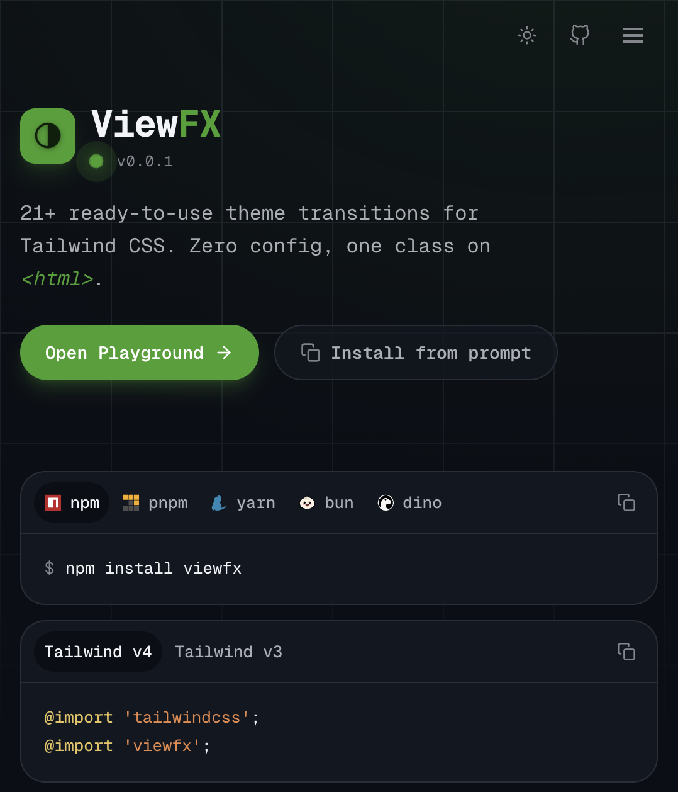

<div align="center">

# ViewFX

[](./README.md)
[](./README.es.md)





Transiciones de tema con una sola clase de Tailwind en <code>&lt;html&gt;</code>.

Visita el [repositorio en GitHub](https://github.com/LuisitoLuis/viewfx) para obtener más información.

</div>

## Instalación :book:

#### Instalar el paquete

> Instala el paquete con tu gestor de paquetes favorito:

- npm

```bash
npm install viewfx
```

- pnpm

```bash
pnpm add viewfx
```

- yarn

```bash
yarn add viewfx
```

#### Implementación del plugin

> Úsalo en tu proyecto de Tailwind CSS:

```css
/* globals.css (para Tailwind CSS 4.*) */
@import 'tailwindcss';
@import 'viewfx';
```

> Tailwind CSS v3 — registra el plugin de JavaScript:

```js
/** @type {import('tailwindcss').Config} */
module.exports = {
  plugins: [
    require('viewfx')
  ]
}
```

## Uso :gear:

#### Ejemplo

> Pon una clase de efecto en `<html>` y envuelve el toggle de tema en `document.startViewTransition`:

```html
<html class="dark circle">
```

```html
<html class="dark circle-duration-1000-delay-300">
```

```js
const switchTheme = () =>
  document.documentElement.classList.toggle('dark')

document.startViewTransition
  ? document.startViewTransition(switchTheme)
  : switchTheme()
```

El timing puede ir en la misma clase (`circle-duration-1000`, `circle-duration-1000-delay-300`) o en utilidades sueltas: `fx-duration-1000`, `fx-delay-300`, `fx-steps-modern`.

El tema se espera como clase `.dark` en `<html>` (el wipe `polygon` se invierte en oscuro).

`prefers-reduced-motion: reduce` se respeta: el tema cambia, el wipe no. Los navegadores sin View Transitions API cambian al instante.

### Efectos

30 utilidades. Pasa el ratón para previsualizar y haz clic para copiar en el [catálogo](https://github.com/LuisitoLuis/viewfx#effects).

`circle`, `circle-blur`, `polygon`, `corner-tl`, `corner-tr`, `corner-bl`, `corner-br`, `iris`, `diamond`, `hexagon`, `square`, `soft`, `heart`, `expand`, `split`, `shutter`, `ink`, `spiral`, `wipe-h`, `wipe-left`, `wipe-v`, `slide-down`, `venetian`, `glitch`, `slide`, `lift`, `zoom`, `rotate`, `fade`, `dissolve`.

## Contribuidores 👑

<a href="https://github.com/LuisitoLuis/viewfx/graphs/contributors">
  
</a>
