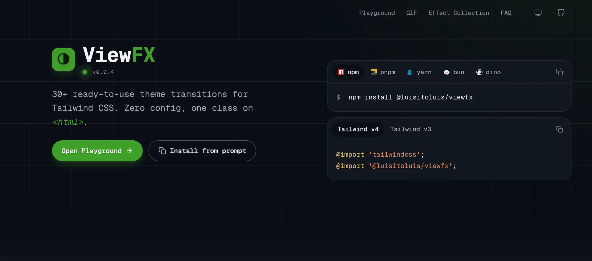

<div align="center">

# ViewFX

[](./README.md)
[](./README.es.md)

[](https://github.com/LuisitoLuis/viewfx/stargazers)
[](https://github.com/LuisitoLuis/viewfx/forks)
[](https://github.com/LuisitoLuis/viewfx/pulls)
[](https://github.com/LuisitoLuis/viewfx/issues)
[](https://github.com/LuisitoLuis/viewfx/graphs/contributors)




[](https://www.npmjs.com/package/@luisitoluis/viewfx)

Theme transitions with one Tailwind class on <code>&lt;html&gt;</code>.

Package: [`@luisitoluis/viewfx`](https://www.npmjs.com/package/@luisitoluis/viewfx)

Visit the [GitHub repository](https://github.com/LuisitoLuis/viewfx) to get more information.

</div>

## Installation :book:

#### Package install

> Install the package with your favorite package manager:

- npm

```bash
npm install @luisitoluis/viewfx
```

- pnpm

```bash
pnpm add @luisitoluis/viewfx
```

- yarn

```bash
yarn add @luisitoluis/viewfx
```

#### Plugin Implementation

> Use the plugin in your Tailwind CSS project:

```css
/* globals.css (for Tailwind CSS 4.*) */
@import 'tailwindcss';
@import '@luisitoluis/viewfx';
```

> Tailwind CSS v3 — register the JavaScript plugin:

```js
/** @type {import('tailwindcss').Config} */
module.exports = {
  plugins: [
    require('@luisitoluis/viewfx')
  ]
}
```

## Usage :gear:

#### Example

> Put an effect class on `<html>`, then wrap your theme toggle in `document.startViewTransition`:

```html
<html class="dark circle">
```

```html
<html class="dark circle-duration-1000-delay-300">
```

```js
const switchTheme = () =>
  document.documentElement.classList.toggle('dark')

document.startViewTransition
  ? document.startViewTransition(switchTheme)
  : switchTheme()
```

Timing can sit in the same class (`circle-duration-1000`, `circle-duration-1000-delay-300`) or as separate utilities: `fx-duration-1000`, `fx-delay-300`, `fx-steps-modern`.

Theme is expected as a `.dark` class on `<html>` (the `polygon` wipe reverses in dark).

`prefers-reduced-motion: reduce` is honoured: the theme still changes, without the wipe. Browsers without the View Transitions API skip the animation and toggle instantly.

### Effects

31 utilities. Hover to preview and click to copy on the [catalogue](https://github.com/LuisitoLuis/viewfx#effects).

`circle`, `circle-blur`, `polygon`, `corner-tl`, `corner-tr`, `corner-bl`, `corner-br`, `iris`, `diamond`, `hexagon`, `square`, `mosaic`, `soft`, `heart`, `expand`, `split`, `shutter`, `ink`, `spiral`, `slide-right`, `slide-left`, `slide-up`, `slide-down`, `venetian`, `glitch`, `slide`, `lift`, `zoom`, `rotate`, `fade`, `dissolve`.

## Contributors 👑

<a href="https://github.com/LuisitoLuis/viewfx/graphs/contributors">
  
</a>
